## The Developer Behind the Code

I am a Full-stack Developer based in Ho Chi Minh City, Vietnam, who turns complex business requirements into simple, useful web applications. My work sits between two worlds:

- **Backend** — APIs, business rules, data models, authentication flows, and reliable integrations with **ASP.NET Core**, **SQL Server** and **PostgreSQL**.
- **Frontend** — responsive, maintainable interfaces with **Angular**, **TypeScript**, and reusable UI components.

> Good software is not just code that works — it is code that people can trust, maintain, and evolve.

## My Engineering Toolkit

<table>
  <tr>
    <td valign="top" width="50%">
      <h3>Backend &amp; Data</h3>
      
      <ul>
        <li>ASP.NET Core &amp; Web API</li>
        <li>C# &amp; Entity Framework Core</li>
        <li>SQL Server, PostgreSQL &amp; database design</li>
        <li>MongoDB &amp; Redis caching</li>
        <li>REST APIs &amp; OpenAPI / Swagger</li>
        <li>Authentication &amp; authorization</li>
        <li>Clean Architecture principles</li>
      </ul>
    </td>
    <td valign="top" width="50%">
      <h3>Frontend &amp; Experience</h3>
      
      <ul>
        <li>Angular &amp; TypeScript</li>
        <li>RxJS &amp; reactive programming</li>
        <li>Responsive web interfaces with Tailwind CSS</li>
        <li>Reactive forms &amp; validation</li>
        <li>Reusable component design</li>
        <li>API integration &amp; HTTP interceptors</li>
      </ul>
    </td>
  </tr>
</table>

### Delivery & Collaboration

`Git` · `GitHub` · `Docker` · `Jenkins` · `Postman` · `Swagger` · `Visual Studio` · `VS Code`

## How I Like to Work

- I prefer clarity over unnecessary complexity.
- I build for maintainability, not only for the current feature.
- I collaborate through clean Git history, useful code reviews, and practical documentation.
- I keep security in mind: secrets stay out of source control, and APIs have clear authentication and validation boundaries.

## Currently Exploring

- Modular monolith and Clean Architecture patterns in ASP.NET Core
- Advanced Angular architecture and scalable component systems
- Dockerized development environments
- Automated testing and CI/CD workflows
- Cloud-ready application design
